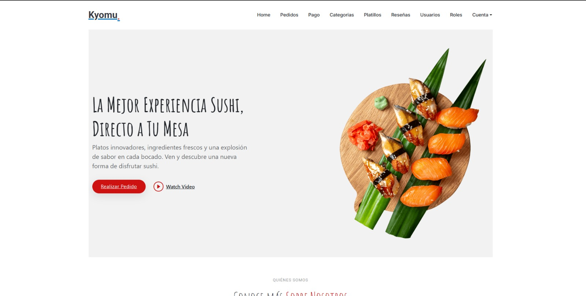
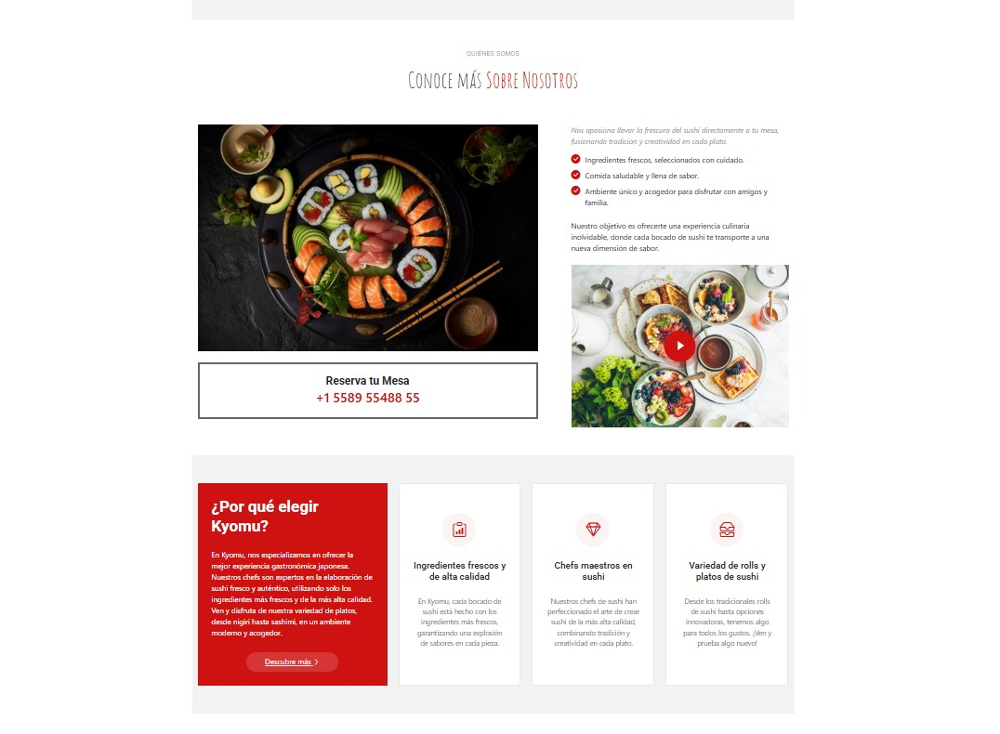
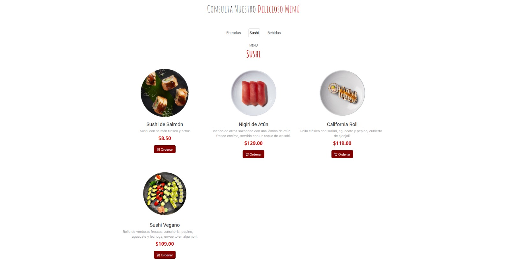
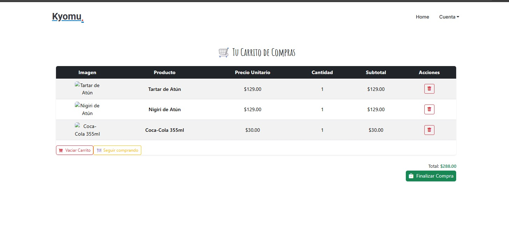
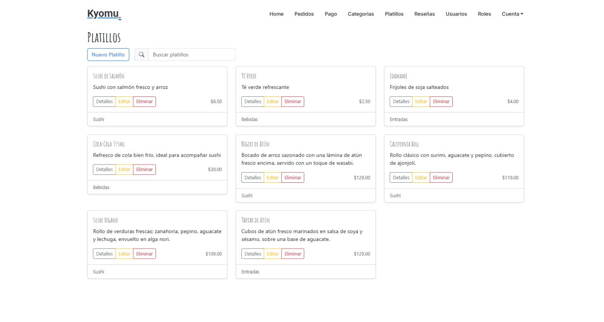

# 🍣 Kyomu

**Kyomu** es una plataforma web para un restaurante de sushi que permite a los usuarios explorar el menú de productos, realizar pedidos usando la función de carrito, y gestionar sus cuentas. La aplicación también está diseñada para los administradores del local, quienes pueden agregar, editar o eliminar platillos, categorías y usuarios, con un sistema de roles que garantiza una correcta gestión de las funcionalidades y pantallas según el tipo de usuario.

---

## ✨ Funcionalidades Principales

- **Explora el menú** de sushi y productos disponibles en el restaurante.
- Los **usuarios pueden realizar pedidos** usando la función de carrito.
- **Sistema de registro y autenticación de usuarios** con roles diferenciados.
- Los **usuarios** pueden gestionar su cuenta y realizar pedidos.
- La **administración** del local tiene acceso a un panel donde pueden agregar, editar y eliminar platillos, categorías, y usuarios.
- **Sistema de roles** que determina las pantallas y funcionalidades visibles según el tipo de usuario.
- **Interfaz amigable** y responsive para dispositivos móviles.

---

## 📸 Vista previa del proyecto

### Página principal



### Menú de productos


### Pantalla del carrito de compras


### Panel de administración


---

## 🛠️ Tecnologías utilizadas

- **C#** con **.NET Core** para el desarrollo de la aplicación
- **ASP.NET Core** para la creación de la API y la autenticación de usuarios
- **Entity Framework** para la gestión de la base de datos
- **HTML/CSS/JavaScript** para la interfaz de usuario
- **SQL Server** para la base de datos

---

## ⚡ Cómo ejecutar el proyecto

```bash
# Clonar el repositorio
git clone https://github.com/tu-usuario/ProyectoKyomu.git
cd ProyectoKyomu

# Asegúrate de tener .NET Core y las otras dependencias instaladas en tu máquina.
# Ejecuta el proyecto usando el siguiente comando:
dotnet run

# El proyecto estará disponible en http://localhost:5000
